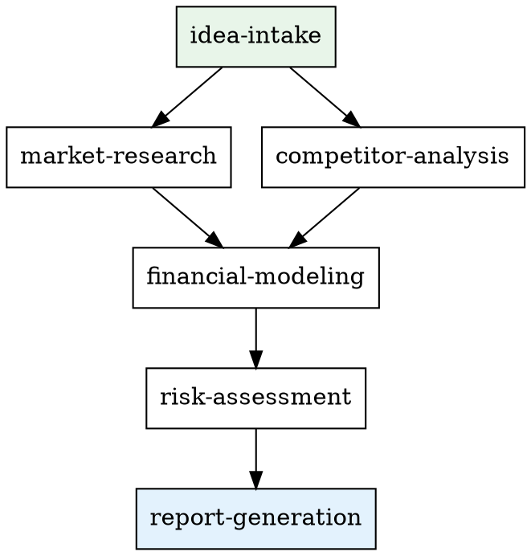
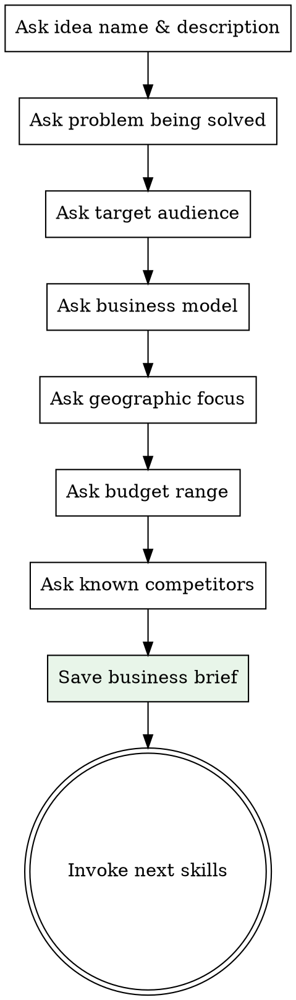
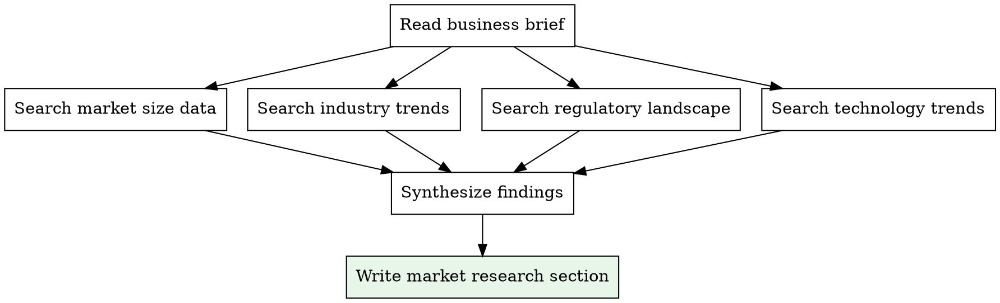
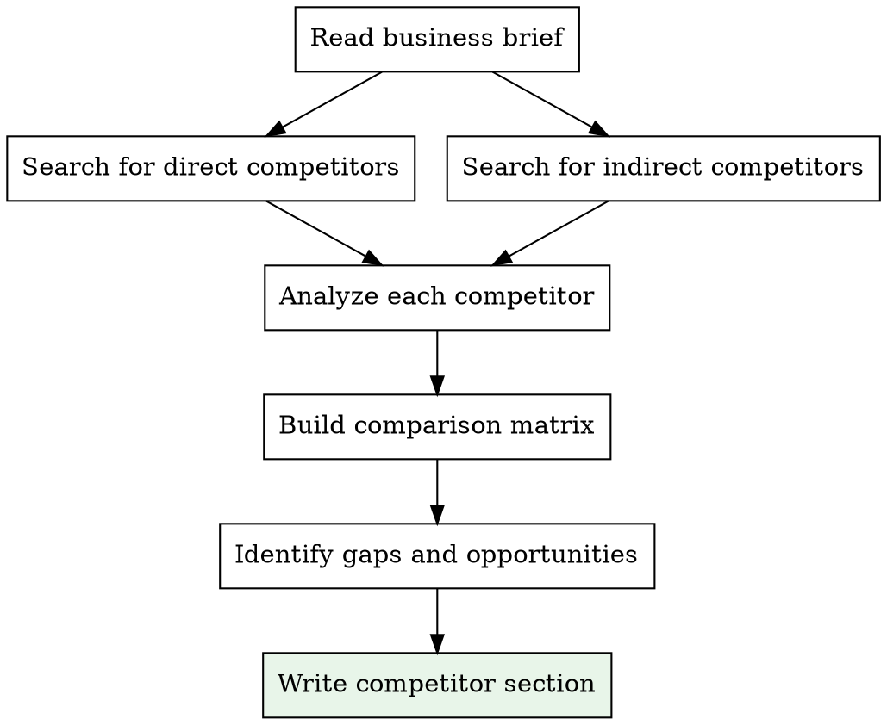
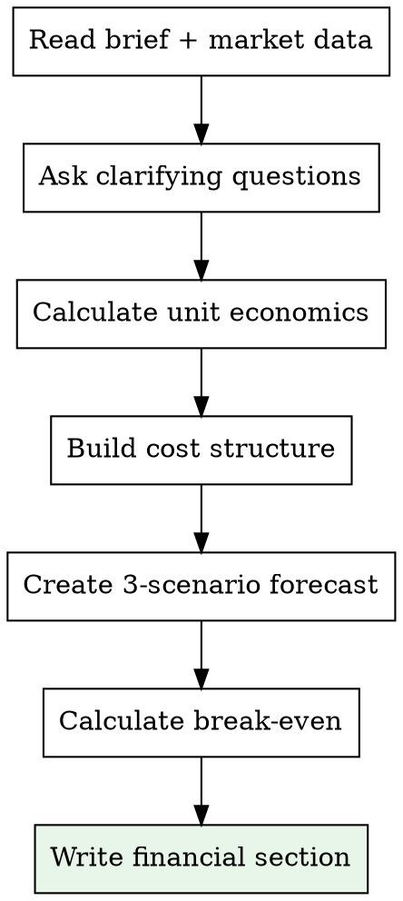
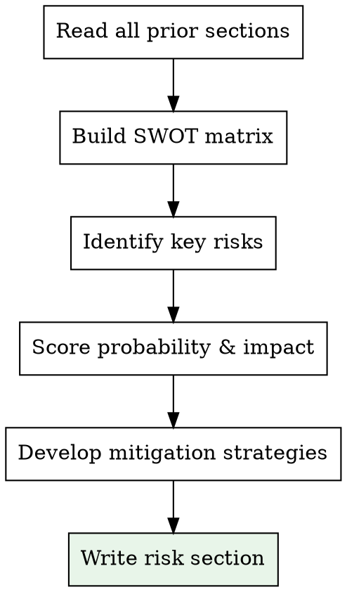
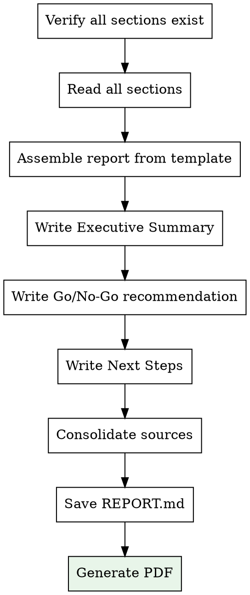

# Business Validator Plugin — Implementation Plan

> **For Claude:** REQUIRED SUB-SKILL: Use superpowers:executing-plans to implement this plan task-by-task.

**Goal:** Build a Claude Code plugin that validates business ideas through a pipeline of skills, producing comprehensive market analysis reports with Go/No-Go recommendations.

**Architecture:** Plugin following the superpowers pattern — SKILL.md files with YAML frontmatter, SessionStart hook for meta-skill injection, slash commands for full/partial pipeline. Data flows between skills via markdown files on disk.

**Tech Stack:** Markdown (SKILL.md), Bash (hooks), JSON (plugin config), pandoc (PDF generation)

---

### Task 1: Plugin Manifest and Hook Infrastructure

**Files:**
- Create: `.claude-plugin/plugin.json`
- Create: `hooks/hooks.json`
- Create: `hooks/session-start.sh`

**Step 1: Create plugin manifest**

Create `.claude-plugin/plugin.json`:

```json
{
  "name": "business-validator",
  "description": "Business idea validation skills: market research, competitor analysis, financial modeling, risk assessment, and Go/No-Go reports",
  "version": "1.0.0",
  "author": {
    "name": "Elvis Musli"
  },
  "license": "MIT",
  "keywords": ["business", "validation", "market-research", "competitor-analysis", "financial-modeling"]
}
```

**Step 2: Create hooks registration**

Create `hooks/hooks.json`:

```json
{
  "hooks": {
    "SessionStart": [
      {
        "matcher": "startup|resume|clear|compact",
        "hooks": [
          {
            "type": "command",
            "command": "${CLAUDE_PLUGIN_ROOT}/hooks/session-start.sh",
            "async": false
          }
        ]
      }
    ]
  }
}
```

**Step 3: Create session-start hook script**

Create `hooks/session-start.sh`:

```bash
#!/usr/bin/env bash
# SessionStart hook for business-validator plugin

set -euo pipefail

SCRIPT_DIR="$(cd "$(dirname "${BASH_SOURCE[0]:-$0}")" && pwd)"
PLUGIN_ROOT="$(cd "${SCRIPT_DIR}/.." && pwd)"

# Read using-business-validator content
using_bv_content=$(cat "${PLUGIN_ROOT}/skills/using-business-validator/SKILL.md" 2>&1 || echo "Error reading using-business-validator skill")

# Escape string for JSON embedding
escape_for_json() {
    local s="$1"
    s="${s//\\/\\\\}"
    s="${s//\"/\\\"}"
    s="${s//$'\n'/\\n}"
    s="${s//$'\r'/\\r}"
    s="${s//$'\t'/\\t}"
    printf '%s' "$s"
}

using_bv_escaped=$(escape_for_json "$using_bv_content")

cat <<EOF
{
  "hookSpecificOutput": {
    "hookEventName": "SessionStart",
    "additionalContext": "<EXTREMELY_IMPORTANT>\nYou have business-validator skills.\n\n**Below is the full content of your 'business-validator:using-business-validator' skill - your introduction to business validation skills. For all other skills, use the 'Skill' tool:**\n\n${using_bv_escaped}\n</EXTREMELY_IMPORTANT>"
  }
}
EOF

exit 0
```

**Step 4: Make hook executable and verify**

Run: `chmod +x hooks/session-start.sh`

**Step 5: Commit**

```bash
git add .claude-plugin/plugin.json hooks/hooks.json hooks/session-start.sh
git commit -m "feat: add plugin manifest and session-start hook infrastructure"
```

---

### Task 2: Meta-Skill — using-business-validator

**Files:**
- Create: `skills/using-business-validator/SKILL.md`

**Step 1: Create the meta-skill**

Create `skills/using-business-validator/SKILL.md`:

```markdown
---
name: using-business-validator
description: Use when starting a conversation about business ideas, market research, or business validation - establishes available business validation skills
---

# Using Business Validator

## Overview

Business Validator provides a pipeline of skills for validating business ideas. Each skill handles one aspect of the analysis and produces a section of the final report.

## Available Skills

| Skill | Purpose | When to Use |
|-------|---------|-------------|
| `business-validator:idea-intake` | Collect business idea details | First step — always start here |
| `business-validator:market-research` | TAM/SAM/SOM, trends, regulation | After idea intake |
| `business-validator:competitor-analysis` | Find and compare competitors | After idea intake (parallel with market-research) |
| `business-validator:financial-modeling` | Unit economics, revenue forecast | After market research |
| `business-validator:risk-assessment` | SWOT, risks, mitigation | After all research is done |
| `business-validator:report-generation` | Assemble final report + PDF | Last step — after all sections ready |

## Commands

- `/validate-idea` — Run the full pipeline from intake to report
- `/market-report` — Run only market-research + competitor-analysis

## Pipeline Flow



## Data Flow

All data is stored in the project's `docs/` directory:

- **Business briefs:** `docs/business-briefs/YYYY-MM-DD-<name>.md`
- **Report sections:** `docs/reports/YYYY-MM-DD-<name>/01-market-research.md` etc.
- **Final report:** `docs/reports/YYYY-MM-DD-<name>/REPORT.md` and `REPORT.pdf`

## How to Invoke Skills

Use the `Skill` tool with the `business-validator:` prefix:

```
Skill: business-validator:idea-intake
Skill: business-validator:market-research
```

## Key Rules

1. **Always start with idea-intake** — other skills need the business brief
2. **market-research and competitor-analysis can run in parallel** — both depend only on the brief
3. **financial-modeling needs market data** — wait for market-research to complete
4. **risk-assessment synthesizes everything** — needs all prior sections
5. **report-generation is always last** — assembles all sections into one report
```

**Step 2: Verify hook can read the file**

Run: `bash hooks/session-start.sh | python3 -m json.tool`
Expected: Valid JSON with the skill content in `additionalContext`

**Step 3: Commit**

```bash
git add skills/using-business-validator/SKILL.md
git commit -m "feat: add using-business-validator meta-skill"
```

---

### Task 3: Skill — idea-intake

**Files:**
- Create: `skills/idea-intake/SKILL.md`

**Step 1: Create the idea-intake skill**

Create `skills/idea-intake/SKILL.md`:

```markdown
---
name: idea-intake
description: Use when a user wants to validate a business idea — collects all required information through interactive questions before research begins
---

# Business Idea Intake

## Overview

Collect all information needed to validate a business idea through a structured series of questions. The output is a business brief saved to `docs/business-briefs/YYYY-MM-DD-<idea-slug>.md`.

<HARD-GATE>
Do NOT proceed to market research, competitor analysis, or any other analysis skill until the business brief is complete and saved. Every field in the brief must be filled.
</HARD-GATE>

## Process

Ask questions ONE AT A TIME via `AskUserQuestion`. Use multiple-choice options where possible.



## Questions to Ask

### 1. Idea Name & Description
- Ask for a short name (2-4 words) and a 1-2 sentence description
- Open-ended question

### 2. Problem Being Solved
- What specific problem or pain point does this solve?
- Open-ended question

### 3. Target Audience
- Who is the primary customer?
- Options: B2B (Small Business), B2B (Enterprise), B2C (Mass Market), B2C (Niche/Premium), B2B2C, Other
- Follow up: estimated willingness to pay

### 4. Business Model
- How will this make money?
- Options: SaaS/Subscription, One-time Purchase, Freemium, Marketplace/Commission, Advertising, Services/Consulting, Other

### 5. Geographic Focus
- Options: Local/City, National, Regional (e.g. Europe, MENA), Global, Online-only (no geo limit)

### 6. Starting Budget
- Options: Bootstrapped (<$5K), Seed ($5K-$50K), Pre-seed ($50K-$500K), Series A+ ($500K+), Not yet determined

### 7. Known Competitors
- Ask if the user already knows any competitors
- Open-ended (can be "none" or a list)

## Business Brief Template

Save to `docs/business-briefs/YYYY-MM-DD-<idea-slug>.md`:

```markdown
# Business Brief: [Idea Name]

**Date:** YYYY-MM-DD
**Status:** Ready for Analysis

## Idea
**Name:** [name]
**Description:** [1-2 sentences]

## Problem
[What problem does this solve]

## Target Audience
**Segment:** [B2B/B2C/etc.]
**Customer Profile:** [description]
**Willingness to Pay:** [estimate]

## Business Model
**Type:** [subscription/etc.]
**Details:** [additional context]

## Market
**Geographic Focus:** [scope]
**Starting Budget:** [range]

## Known Competitors
[List or "None identified"]

## Analysis Queue
- [ ] Market Research
- [ ] Competitor Analysis
- [ ] Financial Model
- [ ] Risk Assessment
- [ ] Final Report
```

## After Saving the Brief

1. Show the user a summary of the brief
2. Ask for confirmation that everything looks correct
3. Dispatch `business-validator:market-research` and `business-validator:competitor-analysis` in parallel using the Task tool with subagents
```

**Step 2: Commit**

```bash
git add skills/idea-intake/SKILL.md
git commit -m "feat: add idea-intake skill for collecting business idea information"
```

---

### Task 4: Skill — market-research

**Files:**
- Create: `skills/market-research/SKILL.md`

**Step 1: Create the market-research skill**

Create `skills/market-research/SKILL.md`:

```markdown
---
name: market-research
description: Use after idea-intake to research market size, trends, and dynamics for a business idea using web search
---

# Market Research

## Overview

Research the market for a business idea using `WebSearch` and `WebFetch`. Produce a structured market analysis section with TAM/SAM/SOM estimates, trends, and sources.

<HARD-GATE>
You MUST read the business brief BEFORE starting research. The brief is at `docs/business-briefs/YYYY-MM-DD-*.md` (find the most recent one or the one specified by the user). Do NOT research without reading the brief first.
</HARD-GATE>

## Process



### Step 1: Read the Business Brief

Read the brief file and extract:
- Industry/niche
- Geographic focus
- Target audience segment
- Business model type

### Step 2: Research Market Size (TAM/SAM/SOM)

Use `WebSearch` with queries like:
- "[industry] market size [year]"
- "[industry] market forecast [geographic focus]"
- "[niche] total addressable market"

Calculate or find:
- **TAM** (Total Addressable Market): The entire market for the product category
- **SAM** (Serviceable Addressable Market): The segment you can reach with your business model
- **SOM** (Serviceable Obtainable Market): Realistic first-year capture

### Step 3: Research Industry Trends

Search for:
- Growth rate (CAGR) and direction
- Key market drivers
- Emerging technologies in the space
- Consumer/buyer behavior shifts
- Regulatory changes or risks

### Step 4: Synthesize and Write

Save output to `docs/reports/YYYY-MM-DD-<idea-slug>/01-market-research.md`:

```markdown
## Market Research

### Market Size

| Metric | Value | Source |
|--------|-------|--------|
| TAM | $X.XB | [source] |
| SAM | $X.XB | [source] |
| SOM (Year 1) | $X.XM | Estimated |

### Market Trends

| Trend | Impact | Direction |
|-------|--------|-----------|
| [trend 1] | [description] | Growing/Declining |

### Growth Dynamics
- CAGR: X.X% (YYYY-YYYY)
- Key drivers: [list]

### Regulatory Environment
[Summary of relevant regulations, if any]

### Technology Trends
[Relevant technology shifts]

### Sources
- [Source 1](url)
- [Source 2](url)
```

## Quality Standards

- Every numeric claim MUST have a source
- Use recent data (within last 2 years when possible)
- Clearly distinguish estimates from cited data
- If data is scarce, state this explicitly rather than guessing
- Include at least 3 different sources
```

**Step 2: Commit**

```bash
git add skills/market-research/SKILL.md
git commit -m "feat: add market-research skill for TAM/SAM/SOM and trend analysis"
```

---

### Task 5: Skill — competitor-analysis

**Files:**
- Create: `skills/competitor-analysis/SKILL.md`

**Step 1: Create the competitor-analysis skill**

Create `skills/competitor-analysis/SKILL.md`:

```markdown
---
name: competitor-analysis
description: Use after idea-intake to find and analyze competitors for a business idea using web search
---

# Competitor Analysis

## Overview

Find and analyze 5-10 competitors for a business idea. Produce a structured competitive landscape section with comparison tables and positioning insights.

<HARD-GATE>
You MUST read the business brief BEFORE starting research. The brief is at `docs/business-briefs/YYYY-MM-DD-*.md`. Do NOT analyze without reading the brief first.
</HARD-GATE>

## Process



### Step 1: Read the Business Brief

Extract the business idea, target audience, business model, and any known competitors listed by the user.

### Step 2: Find Competitors

Use `WebSearch` with queries like:
- "[product category] competitors"
- "[product category] alternatives"
- "best [product type] for [target audience]"
- "top [industry] startups [year]"
- Known competitor names from the brief

Identify:
- **Direct competitors** (same problem, same audience)
- **Indirect competitors** (same problem, different approach OR different problem, same audience)

### Step 3: Analyze Each Competitor

For each competitor (aim for 5-10), research:
- Product/service offering
- Pricing model and tiers
- Target market
- Key differentiators
- Strengths and weaknesses
- Estimated size/funding (if available)
- Online presence (website quality, social media)

### Step 4: Write Output

Save to `docs/reports/YYYY-MM-DD-<idea-slug>/02-competitor-analysis.md`:

```markdown
## Competitive Landscape

### Direct Competitors

| Competitor | Product | Pricing | Target Market | Strengths | Weaknesses |
|------------|---------|---------|--------------|-----------|------------|
| [Name 1] | [desc] | [model] | [who] | [list] | [list] |

### Indirect Competitors

| Competitor | Product | How They Compete | Overlap |
|------------|---------|-----------------|---------|
| [Name] | [desc] | [explanation] | [High/Med/Low] |

### Competitive Positioning Map

| Feature / Dimension | Your Idea | Comp 1 | Comp 2 | Comp 3 |
|---------------------|-----------|--------|--------|--------|
| Price Point | [?] | [$] | [$] | [$] |
| Feature Richness | [?] | [1-5] | [1-5] | [1-5] |
| Market Focus | [?] | [who] | [who] | [who] |

### Market Gaps & Opportunities
- [Gap 1: description of unmet need]
- [Gap 2: description of underserved segment]

### Key Takeaways
- [Insight 1]
- [Insight 2]
- [Insight 3]

### Sources
- [Source 1](url)
```

## Quality Standards

- Minimum 5 competitors analyzed
- Each competitor MUST have verifiable source (website URL)
- Distinguish facts from estimates
- Focus on actionable insights, not just data collection
```

**Step 2: Commit**

```bash
git add skills/competitor-analysis/SKILL.md
git commit -m "feat: add competitor-analysis skill for competitive landscape research"
```

---

### Task 6: Skill — financial-modeling

**Files:**
- Create: `skills/financial-modeling/SKILL.md`

**Step 1: Create the financial-modeling skill**

Create `skills/financial-modeling/SKILL.md`:

```markdown
---
name: financial-modeling
description: Use after market-research to build a financial model with unit economics, revenue forecasts, and break-even analysis for a business idea
---

# Financial Modeling

## Overview

Build a basic financial model for a business idea based on the business brief and market research data. Includes unit economics, 3-scenario revenue forecast, cost structure, and break-even analysis.

<HARD-GATE>
You MUST read both the business brief AND the market research section before building the model. Financial projections without market data are guesswork.
</HARD-GATE>

## Process



### Step 1: Read Inputs

- Business brief: `docs/business-briefs/YYYY-MM-DD-*.md`
- Market research: `docs/reports/YYYY-MM-DD-*/01-market-research.md`
- Competitor analysis: `docs/reports/YYYY-MM-DD-*/02-competitor-analysis.md` (for pricing benchmarks)

### Step 2: Ask Clarifying Questions (if needed)

If the brief doesn't include enough detail, ask the user via `AskUserQuestion`:
- Expected average price point
- Main cost categories
- Team size at launch
- Customer acquisition channels

### Step 3: Build the Model

#### Unit Economics
- **CAC** (Customer Acquisition Cost): Based on industry benchmarks + stated channels
- **ARPU** (Average Revenue Per User): Based on pricing model
- **LTV** (Lifetime Value): ARPU × average lifespan
- **LTV/CAC ratio**: Must be >3 for viability

#### Cost Structure
- Fixed costs (team, infrastructure, tools)
- Variable costs (per-customer costs)
- One-time costs (development, legal, launch)

#### Revenue Forecast (3 scenarios, months 1-36)
- **Pessimistic**: Low acquisition, high churn
- **Base**: Industry-average metrics
- **Optimistic**: Strong product-market fit

#### Break-even Analysis
- Monthly fixed costs / (ARPU - variable cost per customer)
- Months to break-even in each scenario

### Step 4: Write Output

Save to `docs/reports/YYYY-MM-DD-<idea-slug>/03-financial-model.md`:

```markdown
## Financial Model

### Unit Economics

| Metric | Value | Assumption |
|--------|-------|------------|
| ARPU (Monthly) | $X | [basis] |
| CAC | $X | [basis] |
| LTV | $X | [calculation] |
| LTV/CAC | X.X | [interpretation] |
| Gross Margin | X% | [basis] |

### Cost Structure

| Category | Monthly Cost | Type |
|----------|-------------|------|
| Team | $X | Fixed |
| Infrastructure | $X | Fixed |
| Marketing | $X | Variable |
| [Other] | $X | [type] |
| **Total Fixed** | **$X** | |
| **Variable per Customer** | **$X** | |

### Revenue Forecast (36 months)

| Month | Pessimistic | Base | Optimistic |
|-------|-------------|------|------------|
| 3 | $X | $X | $X |
| 6 | $X | $X | $X |
| 12 | $X | $X | $X |
| 24 | $X | $X | $X |
| 36 | $X | $X | $X |

### Break-Even Analysis

| Scenario | Customers Needed | Months to Break-Even |
|----------|-----------------|---------------------|
| Pessimistic | X | X |
| Base | X | X |
| Optimistic | X | X |

### Key Assumptions
- [Assumption 1]
- [Assumption 2]

### Financial Health Indicators
- Burn rate: $X/month
- Runway (with stated budget): X months
- Funding gap (if any): $X
```

## Quality Standards

- All numbers must show their assumptions
- Use industry benchmarks where available, cite sources
- State uncertainty ranges for key assumptions
- Flag any metrics below healthy thresholds (e.g. LTV/CAC < 3)
```

**Step 2: Commit**

```bash
git add skills/financial-modeling/SKILL.md
git commit -m "feat: add financial-modeling skill for unit economics and forecasts"
```

---

### Task 7: Skill — risk-assessment

**Files:**
- Create: `skills/risk-assessment/SKILL.md`

**Step 1: Create the risk-assessment skill**

Create `skills/risk-assessment/SKILL.md`:

```markdown
---
name: risk-assessment
description: Use after all research skills to synthesize SWOT analysis, risk evaluation, and mitigation strategies for a business idea
---

# Risk Assessment

## Overview

Synthesize all prior research (market, competitors, financials) into a SWOT analysis and detailed risk assessment with mitigation strategies.

<HARD-GATE>
You MUST read ALL prior sections before writing the risk assessment. This skill synthesizes — it does not research independently. Required inputs:
- Business brief
- Market research (01-market-research.md)
- Competitor analysis (02-competitor-analysis.md)
- Financial model (03-financial-model.md)
</HARD-GATE>

## Process



### Step 1: Read All Prior Sections

Read from `docs/reports/YYYY-MM-DD-<idea-slug>/`:
- `01-market-research.md`
- `02-competitor-analysis.md`
- `03-financial-model.md`

Plus the business brief.

### Step 2: Build SWOT Matrix

Draw from all sources:
- **Strengths**: What advantages does this idea have? (unique features, team, timing)
- **Weaknesses**: What internal factors work against it? (resources, experience, gaps)
- **Opportunities**: What external factors favor it? (trends, gaps, regulation changes)
- **Threats**: What external factors endanger it? (competitors, regulation, market shifts)

### Step 3: Identify and Score Risks

For each risk:
- Category: Market / Technical / Financial / Operational / Legal
- Probability: High / Medium / Low
- Impact: High / Medium / Low
- Mitigation strategy

### Step 4: Write Output

Save to `docs/reports/YYYY-MM-DD-<idea-slug>/04-risk-assessment.md`:

```markdown
## SWOT Analysis

| | Helpful | Harmful |
|---|---------|---------|
| **Internal** | **Strengths** | **Weaknesses** |
| | - [S1] | - [W1] |
| | - [S2] | - [W2] |
| **External** | **Opportunities** | **Threats** |
| | - [O1] | - [T1] |
| | - [O2] | - [T2] |

## Risk Assessment

### Risk Matrix

| # | Risk | Category | Probability | Impact | Severity |
|---|------|----------|-------------|--------|----------|
| 1 | [description] | Market | High/Med/Low | High/Med/Low | Critical/High/Med/Low |
| 2 | [description] | Financial | High/Med/Low | High/Med/Low | Critical/High/Med/Low |

### Detailed Risk Analysis

#### Risk 1: [Name]
- **Description:** [what could go wrong]
- **Trigger:** [what would cause this]
- **Impact:** [consequences if it happens]
- **Mitigation:** [how to prevent or reduce]
- **Contingency:** [what to do if it happens anyway]

### Risk Summary
- **Critical risks:** X
- **High risks:** X
- **Medium risks:** X
- **Low risks:** X
- **Overall risk profile:** [Low / Moderate / High / Very High]
```
```

**Step 2: Commit**

```bash
git add skills/risk-assessment/SKILL.md
git commit -m "feat: add risk-assessment skill for SWOT and risk analysis"
```

---

### Task 8: Skill — report-generation (+ template)

**Files:**
- Create: `skills/report-generation/SKILL.md`
- Create: `skills/report-generation/report-template.md`

**Step 1: Create the report template**

Create `skills/report-generation/report-template.md`:

```markdown
---
title: "Business Validation Report: [IDEA_NAME]"
date: YYYY-MM-DD
---

# Business Validation Report: [IDEA_NAME]

## Executive Summary

[1-page summary: what the idea is, key market findings, financial viability, main risks, and Go/No-Go recommendation. Written LAST after all sections are assembled.]

---

## 1. Business Idea Overview

**Name:** [name]
**Description:** [description]
**Problem:** [problem statement]
**Target Audience:** [audience]
**Business Model:** [model]
**Geographic Focus:** [geography]

---

[MARKET_RESEARCH_SECTION]

---

[COMPETITOR_ANALYSIS_SECTION]

---

[FINANCIAL_MODEL_SECTION]

---

[SWOT_AND_RISK_SECTION]

---

## 7. Go / No-Go Recommendation

### Verdict: [GO / CONDITIONAL GO / NO-GO]

**Confidence Level:** [High / Medium / Low]

### Justification
[3-5 key reasons supporting the verdict]

### Conditions (if Conditional Go)
[What must be true for this to succeed]

---

## 8. Recommended Next Steps

1. [Step 1]
2. [Step 2]
3. [Step 3]

---

## Sources

[Consolidated list of all sources from all sections]

---

*Report generated by Business Validator on YYYY-MM-DD*
```

**Step 2: Create the report-generation skill**

Create `skills/report-generation/SKILL.md`:

```markdown
---
name: report-generation
description: Use as the final step after all research skills to assemble sections into a complete business validation report with Go/No-Go recommendation and PDF export
---

# Report Generation

## Overview

Assemble all research sections into a unified business validation report. Add Executive Summary, Go/No-Go recommendation, and generate PDF.

<HARD-GATE>
Do NOT generate the report until ALL sections exist:
- `01-market-research.md`
- `02-competitor-analysis.md`
- `03-financial-model.md`
- `04-risk-assessment.md`

If any section is missing, inform the user and invoke the missing skill.
</HARD-GATE>

## Process



### Step 1: Verify and Read Sections

Check that all 4 section files exist in `docs/reports/YYYY-MM-DD-<idea-slug>/`.
Read each one plus the business brief.

### Step 2: Assemble the Report

Use the template at `@report-template.md` as the structure.
Replace placeholders with actual section content.

### Step 3: Write Original Sections

These sections are NOT research — they are synthesis:

#### Executive Summary
- 1 paragraph: What the idea is
- 1 paragraph: Market opportunity (key numbers)
- 1 paragraph: Competitive position
- 1 paragraph: Financial viability
- 1 paragraph: Key risks and recommendation

#### Go / No-Go Recommendation

Score the idea on these dimensions:

| Dimension | Score (1-5) | Weight |
|-----------|-------------|--------|
| Market Size & Growth | X | 25% |
| Competitive Position | X | 20% |
| Financial Viability | X | 25% |
| Risk Profile | X | 15% |
| Founder Readiness | X | 15% |
| **Weighted Total** | **X.X / 5.0** | |

Decision framework:
- **4.0+**: GO — Strong opportunity
- **3.0-3.9**: CONDITIONAL GO — Proceed with caution, address key risks
- **2.0-2.9**: NO-GO — Significant issues must be resolved first
- **<2.0**: NO-GO — Fundamental viability concerns

#### Next Steps
If GO or CONDITIONAL GO, provide 5-7 concrete next steps ordered by priority.

### Step 4: Save Report

Write to `docs/reports/YYYY-MM-DD-<idea-slug>/REPORT.md`

### Step 5: Generate PDF

Run via Bash:
```bash
pandoc REPORT.md -o REPORT.pdf --pdf-engine=wkhtmltopdf -V margin-top=25mm -V margin-bottom=25mm -V margin-left=20mm -V margin-right=20mm
```

If `pandoc` is not installed, inform the user:
"PDF generation requires pandoc. Install with: `brew install pandoc` (macOS) or `apt install pandoc` (Linux). The Markdown report is ready at `docs/reports/.../REPORT.md`."

### Step 6: Present Results

Show the user:
1. Path to the Markdown report
2. Path to the PDF (if generated)
3. The Executive Summary
4. The Go/No-Go verdict and score
```

**Step 3: Commit**

```bash
git add skills/report-generation/SKILL.md skills/report-generation/report-template.md
git commit -m "feat: add report-generation skill with template and Go/No-Go framework"
```

---

### Task 9: Slash Commands

**Files:**
- Create: `commands/validate-idea.md`
- Create: `commands/market-report.md`

**Step 1: Create validate-idea command**

Create `commands/validate-idea.md`:

```markdown
---
description: Run the full business validation pipeline — from idea intake to final report with Go/No-Go recommendation
disable-model-invocation: true
---

Invoke the business-validator:idea-intake skill and follow it exactly. After the business brief is saved, run the full pipeline: market-research and competitor-analysis in parallel, then financial-modeling, then risk-assessment, then report-generation. Follow each skill exactly as presented.
```

**Step 2: Create market-report command**

Create `commands/market-report.md`:

```markdown
---
description: Run a quick market overview — market research and competitor analysis only
disable-model-invocation: true
---

Invoke the business-validator:idea-intake skill to collect business idea information. After the brief is saved, invoke business-validator:market-research and business-validator:competitor-analysis in parallel using the Task tool. Present the results to the user when both are complete.
```

**Step 3: Commit**

```bash
git add commands/validate-idea.md commands/market-report.md
git commit -m "feat: add /validate-idea and /market-report slash commands"
```

---

### Task 10: Final Verification and README

**Files:**
- Create: `.gitignore`

**Step 1: Create .gitignore**

Create `.gitignore`:

```
# Reports (generated, not committed by default)
docs/reports/
docs/business-briefs/

# OS files
.DS_Store
```

**Step 2: Verify complete directory structure**

Run: `find . -type f -not -path './.git/*' | sort`

Expected output:
```
./.claude-plugin/plugin.json
./.gitignore
./commands/market-report.md
./commands/validate-idea.md
./docs/plans/2026-02-19-business-validator-design.md
./docs/plans/2026-02-19-business-validator-implementation.md
./hooks/hooks.json
./hooks/session-start.sh
./skills/competitor-analysis/SKILL.md
./skills/financial-modeling/SKILL.md
./skills/idea-intake/SKILL.md
./skills/market-research/SKILL.md
./skills/report-generation/SKILL.md
./skills/report-generation/report-template.md
./skills/risk-assessment/SKILL.md
./skills/using-business-validator/SKILL.md
```

**Step 3: Verify hook works**

Run: `cd ~/projects/business-validator && bash hooks/session-start.sh | python3 -m json.tool`
Expected: Valid JSON, no errors

**Step 4: Commit**

```bash
git add .gitignore docs/plans/2026-02-19-business-validator-implementation.md
git commit -m "feat: add .gitignore and implementation plan"
```

**Step 5: Final summary commit tag**

```bash
git tag v1.0.0
```
