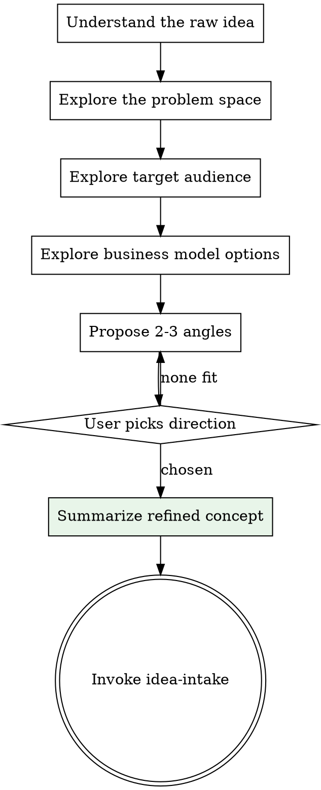

# Business Idea Brainstorming

## Overview

Help the user turn a raw business idea into a refined concept through natural collaborative dialogue. Explore the idea from multiple angles, challenge assumptions, and refine the value proposition before moving to structured intake.

<HARD-GATE>
This skill MUST run before idea-intake. Do NOT skip brainstorming regardless of how clear the idea seems. Even "obvious" ideas have unexamined assumptions that waste research effort downstream.
</HARD-GATE>

## Process



## The Process

Ask questions **one at a time** via `AskUserQuestion`. Prefer multiple-choice where possible.

### Phase 1: Understand the Raw Idea

Start with one open-ended question:
- "Tell me your business idea in a few sentences — what is it and why does it matter?"

Listen. Don't jump to structure yet.

### Phase 2: Explore the Problem Space

One question at a time:
- Is this a problem you've experienced personally?
- How are people solving this problem today? (Options: Manual workaround, Existing tools that don't fit well, They don't — they just live with it, Other)
- How painful is this problem? (Options: Mild inconvenience, Significant frustration, Costs real money/time, Mission-critical blocker)
- What triggers the moment someone realizes they need a solution?

### Phase 3: Explore Target Audience

- Who has this problem the most? (Options: Individuals/consumers, Small businesses, Mid-market companies, Enterprises, Specific profession/role, Other)
- Can you describe your ideal first 10 customers?
- How do these people currently find solutions? (Options: Google search, Word of mouth, Industry publications, They don't look — they've given up, Other)

### Phase 4: Explore Business Model Options

Based on what you've learned, propose 2-3 realistic business model options:
- Present each with one sentence explaining why it fits
- Include trade-offs (e.g. "Subscription gives recurring revenue but requires continuous value delivery")
- Ask which resonates most

### Phase 5: Propose 2-3 Angles

Synthesize everything into 2-3 concrete product/positioning angles. For each angle:
- **One-liner**: What it is in one sentence
- **Key bet**: The main assumption that must be true
- **Advantage**: Why this angle could win
- **Risk**: The biggest concern

Present all angles and ask the user to pick one (or combine elements).

### Phase 6: Summarize Refined Concept

Present a short summary of the refined idea:

```
## Refined Business Concept

**Idea:** [one sentence]
**Problem:** [what it solves]
**For:** [who]
**How it makes money:** [model]
**Key bet:** [the assumption that must hold]
**Unique angle:** [what makes this different]
```

Ask: "Does this capture what we want to validate? Anything to adjust before we start the formal intake?"

## After Brainstorming

Once the user confirms the refined concept:
1. Invoke `business-validator:idea-intake` to begin structured data collection
2. The refined concept gives idea-intake a head start — many questions will already be partially answered

**The terminal state is invoking idea-intake.** Do NOT invoke any research skill directly from brainstorming.

## Key Principles

- **One question at a time** — don't overwhelm
- **Multiple choice preferred** — faster for the user
- **Challenge assumptions** — "why do you think X?" is a valid question
- **Stay curious, not critical** — the goal is to refine, not to judge
- **No research yet** — this is pure dialogue, no WebSearch
- **Keep it to 5-10 minutes** — enough to refine, not so much that it delays the pipeline
