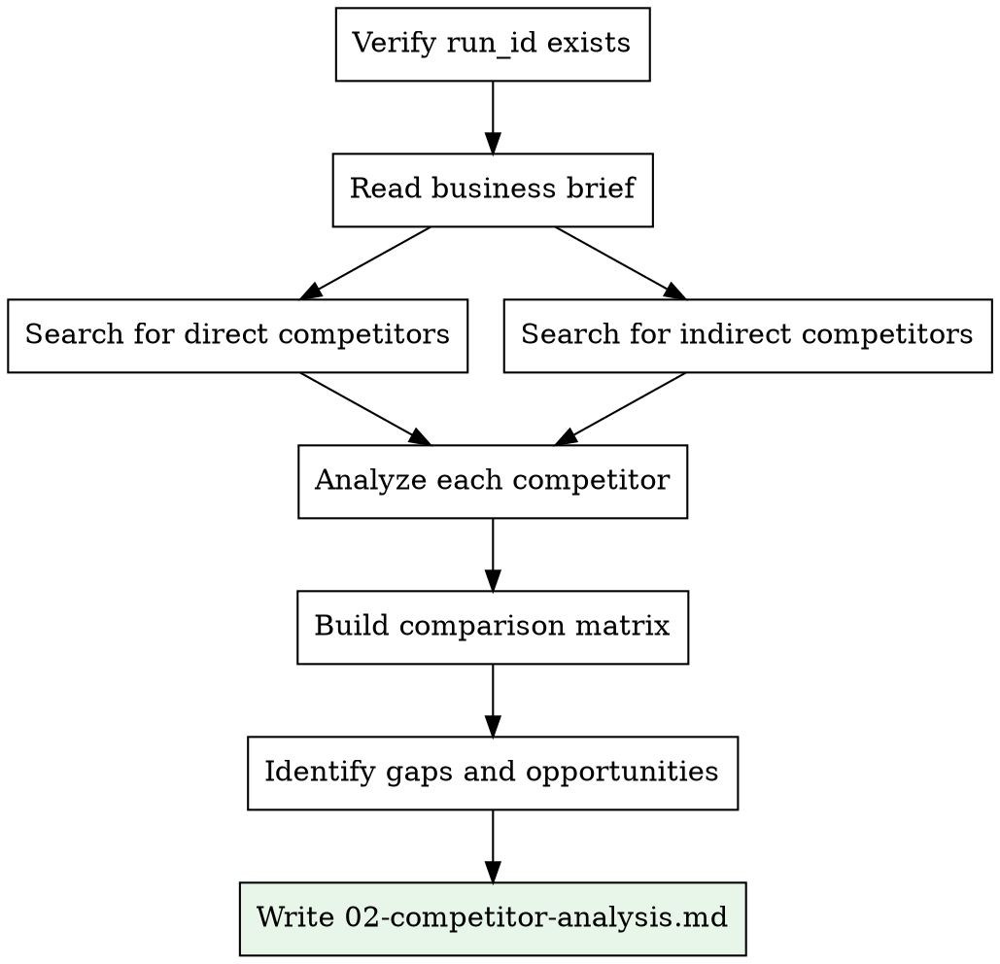

# Competitor Analysis

## Overview

Find and analyze 5-10 competitors for a business idea. Produce a structured competitive landscape section with comparison tables and positioning insights.

<HARD-GATE>
You MUST have the run_id before starting. Read the business brief at `docs/business-briefs/<run_id>.md` using the exact run_id provided. Do NOT glob for files or use "most recent". If you do not have a run_id, ask the user or invoke business-validator:idea-intake first.
</HARD-GATE>

## Inputs

- **run_id**: Provided by idea-intake or the user (format: `YYYY-MM-DD-<slug>-<hhmm>`)
- **Business brief**: `docs/business-briefs/<run_id>.md`

## Output

- **File**: `docs/reports/<run_id>/02-competitor-analysis.md`

## Process



### Step 1: Read the Business Brief

Extract the business idea, target audience, business model, and any known competitors listed by the user.

### Step 2: Find Competitors

Use `WebSearch` with queries like:
- "[product category] competitors"
- "[product category] alternatives"
- "best [product type] for [target audience]"
- "top [industry] startups [year]"
- Known competitor names from the brief

Identify:
- **Direct competitors** (same problem, same audience)
- **Indirect competitors** (same problem, different approach OR different problem, same audience)

### Step 3: Analyze Each Competitor

For each competitor (aim for 5-10), research:
- Product/service offering
- Pricing model and tiers
- Target market
- Key differentiators
- Strengths and weaknesses
- Estimated size/funding (if available)
- Online presence (website quality, social media)

### Step 4: Write Output

Ensure the output directory exists: `mkdir -p docs/reports/<run_id>`

Save to `docs/reports/<run_id>/02-competitor-analysis.md`:

```
## Competitive Landscape

**Run ID:** <run_id>

### Direct Competitors

| Competitor | Product | Pricing | Target Market | Strengths | Weaknesses |
|------------|---------|---------|--------------|-----------|------------|
| [Name 1] | [desc] | [model] | [who] | [list] | [list] |

### Indirect Competitors

| Competitor | Product | How They Compete | Overlap |
|------------|---------|-----------------|---------|
| [Name] | [desc] | [explanation] | [High/Med/Low] |

### Competitive Positioning Map

| Feature / Dimension | Your Idea | Comp 1 | Comp 2 | Comp 3 |
|---------------------|-----------|--------|--------|--------|
| Price Point | [?] | [$] | [$] | [$] |
| Feature Richness | [?] | [1-5] | [1-5] | [1-5] |
| Market Focus | [?] | [who] | [who] | [who] |

### Market Gaps and Opportunities
- [Gap 1: description of unmet need]
- [Gap 2: description of underserved segment]

### Key Takeaways
- [Insight 1]
- [Insight 2]
- [Insight 3]

### Sources
- [Source 1](url)
```

## Quality Standards

- Minimum 5 competitors analyzed
- Each competitor MUST have verifiable source (website URL)
- Distinguish facts from estimates
- Focus on actionable insights, not just data collection
