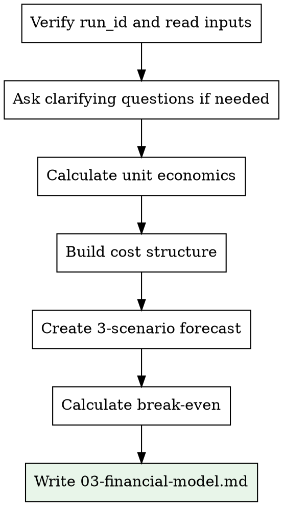

# Financial Modeling

## Overview

Build a basic financial model for a business idea based on the business brief and market research data. Includes unit economics, 3-scenario revenue forecast, cost structure, and break-even analysis.

<HARD-GATE>
You MUST have the run_id and read both the business brief AND the market research section before building the model. Financial projections without market data are guesswork. Required files:
- `docs/business-briefs/<run_id>.md`
- `docs/reports/<run_id>/01-market-research.md`
- `docs/reports/<run_id>/02-competitor-analysis.md` (for pricing benchmarks)
</HARD-GATE>

## Inputs

- **run_id**: From idea-intake (format: `YYYY-MM-DD-<slug>-<hhmm>`)
- **Business brief**: `docs/business-briefs/<run_id>.md`
- **Market research**: `docs/reports/<run_id>/01-market-research.md`
- **Competitor analysis**: `docs/reports/<run_id>/02-competitor-analysis.md`

## Output

- **File**: `docs/reports/<run_id>/03-financial-model.md`

## Process



### Step 1: Read Inputs

Read all three input files using the exact run_id. Extract:
- Target audience and willingness to pay (from brief)
- Market size and growth (from market research)
- Competitor pricing (from competitor analysis)

### Step 2: Ask Clarifying Questions (if needed)

If the brief lacks detail, ask the user via `AskUserQuestion`:
- Expected average price point
- Main cost categories
- Team size at launch
- Customer acquisition channels

### Step 3: Build the Model

#### Unit Economics
- **CAC** (Customer Acquisition Cost): Based on industry benchmarks + stated channels
- **ARPU** (Average Revenue Per User): Based on pricing model
- **LTV** (Lifetime Value): ARPU multiplied by average customer lifespan
- **LTV/CAC ratio**: Must be greater than 3 for viability

#### Cost Structure
- Fixed costs (team, infrastructure, tools)
- Variable costs (per-customer costs)
- One-time costs (development, legal, launch)

#### Revenue Forecast (3 scenarios, months 1-36)
- **Pessimistic**: Low acquisition, high churn
- **Base**: Industry-average metrics
- **Optimistic**: Strong product-market fit

#### Break-even Analysis
- Monthly fixed costs divided by (ARPU minus variable cost per customer)
- Months to break-even in each scenario

### Step 4: Write Output

Ensure the output directory exists: `mkdir -p docs/reports/<run_id>`

Save to `docs/reports/<run_id>/03-financial-model.md`:

```
## Financial Model

**Run ID:** <run_id>

### Unit Economics

| Metric | Value | Assumption |
|--------|-------|------------|
| ARPU (Monthly) | $X | [basis] |
| CAC | $X | [basis] |
| LTV | $X | [calculation] |
| LTV/CAC | X.X | [interpretation] |
| Gross Margin | X% | [basis] |

### Cost Structure

| Category | Monthly Cost | Type |
|----------|-------------|------|
| Team | $X | Fixed |
| Infrastructure | $X | Fixed |
| Marketing | $X | Variable |
| [Other] | $X | [type] |
| **Total Fixed** | **$X** | |
| **Variable per Customer** | **$X** | |

### Revenue Forecast (36 months)

| Month | Pessimistic | Base | Optimistic |
|-------|-------------|------|------------|
| 3 | $X | $X | $X |
| 6 | $X | $X | $X |
| 12 | $X | $X | $X |
| 24 | $X | $X | $X |
| 36 | $X | $X | $X |

### Break-Even Analysis

| Scenario | Customers Needed | Months to Break-Even |
|----------|-----------------|---------------------|
| Pessimistic | X | X |
| Base | X | X |
| Optimistic | X | X |

### Key Assumptions
- [Assumption 1]
- [Assumption 2]

### Financial Health Indicators
- Burn rate: $X/month
- Runway (with stated budget): X months
- Funding gap (if any): $X
```

## Quality Standards

- All numbers must show their assumptions
- Use industry benchmarks where available, cite sources
- State uncertainty ranges for key assumptions
- Flag any metrics below healthy thresholds (e.g. LTV/CAC less than 3)
