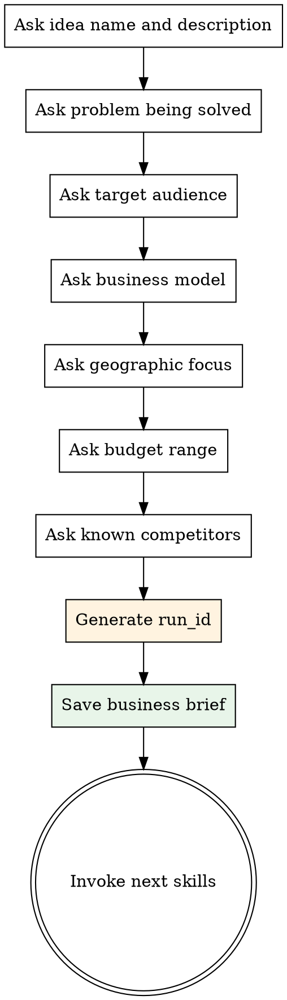

# Business Idea Intake

## Overview

Collect all information needed to validate a business idea through a structured series of questions. The output is a business brief saved to `docs/business-briefs/<run_id>.md` where run_id is generated as `YYYY-MM-DD-<idea-slug>`.

<HARD-GATE>
Do NOT proceed to market research, competitor analysis, or any other analysis skill until the business brief is complete and saved. Every field in the brief must be filled. The run_id must be generated and communicated to the user.
</HARD-GATE>

## Run ID Generation

Generate the run_id as: `YYYY-MM-DD-<slug>` where:
- `YYYY-MM-DD` is today's date
- `<slug>` is the idea name lowercased, spaces replaced with hyphens, max 30 chars
- Example: `2026-02-19-ai-tutor-platform`

The run_id is used by ALL subsequent skills. Pass it explicitly when invoking them.

## Process

Ask questions ONE AT A TIME via `AskUserQuestion`. Use multiple-choice options where possible.



## Questions to Ask

### 1. Idea Name and Description
- Ask for a short name (2-4 words) and a 1-2 sentence description
- Open-ended question

### 2. Problem Being Solved
- What specific problem or pain point does this solve?
- Open-ended question

### 3. Target Audience
- Who is the primary customer?
- Options: B2B (Small Business), B2B (Enterprise), B2C (Mass Market), B2C (Niche/Premium), B2B2C, Other
- Follow up: estimated willingness to pay

### 4. Business Model
- How will this make money?
- Options: SaaS/Subscription, One-time Purchase, Freemium, Marketplace/Commission, Advertising, Services/Consulting, Other

### 5. Geographic Focus
- Options: Local/City, National, Regional (e.g. Europe, MENA), Global, Online-only (no geo limit)

### 6. Starting Budget
- Options: Bootstrapped (less than $5K), Seed ($5K-$50K), Pre-seed ($50K-$500K), Series A+ ($500K+), Not yet determined

### 7. Known Competitors
- Ask if the user already knows any competitors
- Open-ended (can be "none" or a list)

## Business Brief Template

Save to `docs/business-briefs/<run_id>.md`:

```
# Business Brief: [Idea Name]

**Run ID:** <run_id>
**Date:** YYYY-MM-DD
**Status:** Ready for Analysis

## Idea
**Name:** [name]
**Description:** [1-2 sentences]

## Problem
[What problem does this solve]

## Target Audience
**Segment:** [B2B/B2C/etc.]
**Customer Profile:** [description]
**Willingness to Pay:** [estimate]

## Business Model
**Type:** [subscription/etc.]
**Details:** [additional context]

## Market
**Geographic Focus:** [scope]
**Starting Budget:** [range]

## Known Competitors
[List or "None identified"]

## Analysis Queue
- [ ] Market Research
- [ ] Competitor Analysis
- [ ] Financial Model
- [ ] Risk Assessment
- [ ] Final Report
```

## After Saving the Brief

1. Show the user a summary of the brief and the run_id
2. Ask for confirmation that everything looks correct
3. Create the report directory: `docs/reports/<run_id>/`
4. Dispatch `business-validator:market-research` and `business-validator:competitor-analysis` in parallel using the Task tool with subagents, passing the run_id to both
