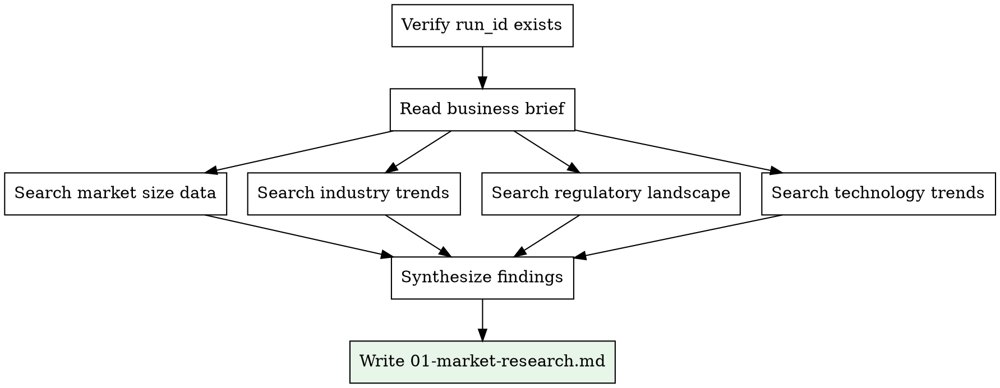

# Market Research

## Overview

Research the market for a business idea using `WebSearch` and `WebFetch`. Produce a structured market analysis section with TAM/SAM/SOM estimates, trends, and sources.

<HARD-GATE>
You MUST have the run_id before starting. Read the business brief at `docs/business-briefs/<run_id>.md` using the exact run_id provided. Do NOT glob for files or use "most recent". If you do not have a run_id, ask the user or invoke business-validator:idea-intake first.
</HARD-GATE>

## Inputs

- **run_id**: Provided by idea-intake or the user (format: `YYYY-MM-DD-<slug>`)
- **Business brief**: `docs/business-briefs/<run_id>.md`

## Output

- **File**: `docs/reports/<run_id>/01-market-research.md`

## Process



### Step 1: Read the Business Brief

Read `docs/business-briefs/<run_id>.md` and extract:
- Industry/niche
- Geographic focus
- Target audience segment
- Business model type

### Step 2: Research Market Size (TAM/SAM/SOM)

Use `WebSearch` with queries like:
- "[industry] market size [year]"
- "[industry] market forecast [geographic focus]"
- "[niche] total addressable market"

Calculate or find:
- **TAM** (Total Addressable Market): The entire market for the product category
- **SAM** (Serviceable Addressable Market): The segment reachable with the business model
- **SOM** (Serviceable Obtainable Market): Realistic first-year capture

### Step 3: Research Industry Trends

Search for:
- Growth rate (CAGR) and direction
- Key market drivers
- Emerging technologies in the space
- Consumer/buyer behavior shifts
- Regulatory changes or risks

### Step 4: Write Output

Save to `docs/reports/<run_id>/01-market-research.md`:

```
## Market Research

**Run ID:** <run_id>

### Market Size

| Metric | Value | Source |
|--------|-------|--------|
| TAM | $X.XB | [source] |
| SAM | $X.XB | [source] |
| SOM (Year 1) | $X.XM | Estimated |

### Market Trends

| Trend | Impact | Direction |
|-------|--------|-----------|
| [trend 1] | [description] | Growing/Declining |

### Growth Dynamics
- CAGR: X.X% (YYYY-YYYY)
- Key drivers: [list]

### Regulatory Environment
[Summary of relevant regulations, if any]

### Technology Trends
[Relevant technology shifts]

### Sources
- [Source 1](url)
- [Source 2](url)
```

## Quality Standards

- Every numeric claim MUST have a source
- Use recent data (within last 2 years when possible)
- Clearly distinguish estimates from cited data
- If data is scarce, state this explicitly rather than guessing
- Include at least 3 different sources
