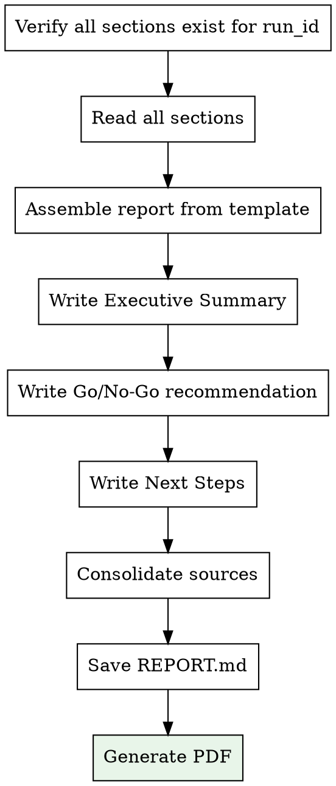

# Report Generation

## Overview

Assemble all research sections into a unified business validation report. Add Executive Summary, Go/No-Go recommendation, and generate PDF.

<HARD-GATE>
Do NOT generate the report until ALL sections exist for the given run_id:
- `docs/reports/<run_id>/01-market-research.md`
- `docs/reports/<run_id>/02-competitor-analysis.md`
- `docs/reports/<run_id>/03-financial-model.md`
- `docs/reports/<run_id>/04-risk-assessment.md`

If any section is missing, inform the user and invoke the missing skill with the run_id.
</HARD-GATE>

## Inputs

- **run_id**: From idea-intake (format: `YYYY-MM-DD-<slug>`)
- **Business brief**: `docs/business-briefs/<run_id>.md`
- **All 4 section files** in `docs/reports/<run_id>/`

## Output

- **Markdown**: `docs/reports/<run_id>/REPORT.md`
- **PDF**: `docs/reports/<run_id>/REPORT.pdf`

## Process



### Step 1: Verify and Read Sections

Check that all 4 section files exist in `docs/reports/<run_id>/` using the exact run_id.
Read each one plus the business brief.

### Step 2: Assemble the Report

Use the template at `@report-template.md` as the structure.
Replace placeholders with actual section content.

### Step 3: Write Original Sections

These sections are NOT research — they are synthesis:

#### Executive Summary
- 1 paragraph: What the idea is
- 1 paragraph: Market opportunity (key numbers)
- 1 paragraph: Competitive position
- 1 paragraph: Financial viability
- 1 paragraph: Key risks and recommendation

#### Go / No-Go Recommendation

Score the idea on these dimensions:

| Dimension | Score (1-5) | Weight |
|-----------|-------------|--------|
| Market Size and Growth | X | 25% |
| Competitive Position | X | 20% |
| Financial Viability | X | 25% |
| Risk Profile | X | 15% |
| Founder Readiness | X | 15% |
| **Weighted Total** | **X.X / 5.0** | |

Decision framework:
- **4.0+**: GO — Strong opportunity
- **3.0-3.9**: CONDITIONAL GO — Proceed with caution, address key risks
- **2.0-2.9**: NO-GO — Significant issues must be resolved first
- **Below 2.0**: NO-GO — Fundamental viability concerns

#### Next Steps
If GO or CONDITIONAL GO, provide 5-7 concrete next steps ordered by priority.

### Step 4: Save Report

Write to `docs/reports/<run_id>/REPORT.md`

### Step 5: Generate PDF

Attempt PDF generation via pandoc:

```bash
pandoc docs/reports/<run_id>/REPORT.md -o docs/reports/<run_id>/REPORT.pdf -V margin-top=25mm -V margin-bottom=25mm -V margin-left=20mm -V margin-right=20mm
```

If `pandoc` is not installed, inform the user:
"PDF generation requires pandoc. Install with: `brew install pandoc` (macOS) or `apt install pandoc` (Linux). The Markdown report is ready at `docs/reports/<run_id>/REPORT.md`."

If pandoc is installed but the default PDF engine is not available, try:
```bash
pandoc docs/reports/<run_id>/REPORT.md -o docs/reports/<run_id>/REPORT.pdf --pdf-engine=weasyprint
```

Or suggest the user install a LaTeX distribution: `brew install basictex`

### Step 6: Present Results

Show the user:
1. The run_id
2. Path to the Markdown report
3. Path to the PDF (if generated)
4. The Executive Summary
5. The Go/No-Go verdict and score
