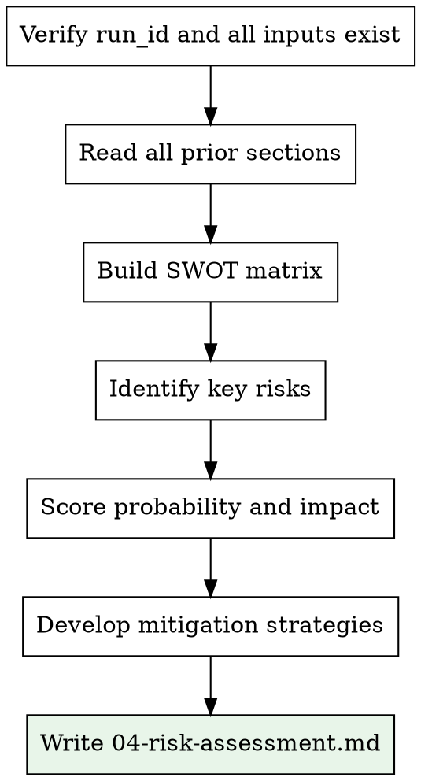

# Risk Assessment

## Overview

Synthesize all prior research (market, competitors, financials) into a SWOT analysis and detailed risk assessment with mitigation strategies.

<HARD-GATE>
You MUST read ALL prior sections before writing the risk assessment. This skill synthesizes — it does not research independently. Required inputs (all using exact run_id):
- `docs/business-briefs/<run_id>.md`
- `docs/reports/<run_id>/01-market-research.md`
- `docs/reports/<run_id>/02-competitor-analysis.md`
- `docs/reports/<run_id>/03-financial-model.md`

If any file is missing, stop and inform the user which skill needs to run first.
</HARD-GATE>

## Inputs

- **run_id**: From idea-intake (format: `YYYY-MM-DD-<slug>-<hhmm>`)
- All four files listed above

## Output

- **File**: `docs/reports/<run_id>/04-risk-assessment.md`

## Process



### Step 1: Read All Prior Sections

Read all files using the exact run_id. Synthesize key findings from each.

### Step 2: Build SWOT Matrix

Draw from all sources:
- **Strengths**: What advantages does this idea have? (unique features, team, timing)
- **Weaknesses**: What internal factors work against it? (resources, experience, gaps)
- **Opportunities**: What external factors favor it? (trends, gaps, regulation changes)
- **Threats**: What external factors endanger it? (competitors, regulation, market shifts)

### Step 3: Identify and Score Risks

For each risk:
- Category: Market / Technical / Financial / Operational / Legal
- Probability: High / Medium / Low
- Impact: High / Medium / Low
- Severity: Critical / High / Medium / Low (derived from probability x impact)
- Mitigation strategy
- Contingency plan

### Step 4: Write Output

Ensure the output directory exists: `mkdir -p docs/reports/<run_id>`

Save to `docs/reports/<run_id>/04-risk-assessment.md`:

```
## SWOT Analysis

**Run ID:** <run_id>

| | Helpful | Harmful |
|---|---------|---------|
| **Internal** | **Strengths** | **Weaknesses** |
| | - [S1] | - [W1] |
| | - [S2] | - [W2] |
| **External** | **Opportunities** | **Threats** |
| | - [O1] | - [T1] |
| | - [O2] | - [T2] |

## Risk Assessment

### Risk Matrix

| # | Risk | Category | Probability | Impact | Severity |
|---|------|----------|-------------|--------|----------|
| 1 | [description] | Market | High/Med/Low | High/Med/Low | Critical/High/Med/Low |
| 2 | [description] | Financial | High/Med/Low | High/Med/Low | Critical/High/Med/Low |

### Detailed Risk Analysis

#### Risk 1: [Name]
- **Description:** [what could go wrong]
- **Trigger:** [what would cause this]
- **Impact:** [consequences if it happens]
- **Mitigation:** [how to prevent or reduce]
- **Contingency:** [what to do if it happens anyway]

### Risk Summary
- **Critical risks:** X
- **High risks:** X
- **Medium risks:** X
- **Low risks:** X
- **Overall risk profile:** [Low / Moderate / High / Very High]
```
