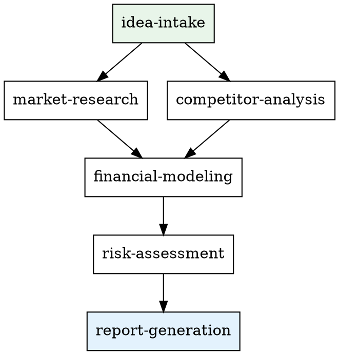

# Using Business Validator

## Overview

Business Validator provides a pipeline of skills for validating business ideas. Each skill handles one aspect of the analysis and produces a section of the final report.

## Available Skills

| Skill | Purpose | When to Use |
|-------|---------|-------------|
| `business-validator:idea-intake` | Collect business idea details | First step — always start here |
| `business-validator:market-research` | TAM/SAM/SOM, trends, regulation | After idea intake |
| `business-validator:competitor-analysis` | Find and compare competitors | After idea intake (parallel with market-research) |
| `business-validator:financial-modeling` | Unit economics, revenue forecast | After market research |
| `business-validator:risk-assessment` | SWOT, risks, mitigation | After all research is done |
| `business-validator:report-generation` | Assemble final report + PDF | Last step — after all sections ready |

## Commands

- `/validate-idea` — Run the full pipeline from intake to report
- `/market-report` — Run only market-research + competitor-analysis

## Run ID

Every validation session has a **run_id** in the format `YYYY-MM-DD-<slug>` (e.g. `2026-02-19-ai-tutor`).

- `idea-intake` generates the run_id from the date and idea name
- All subsequent skills receive the run_id as context
- File paths use the run_id explicitly — never glob for "most recent"

## Data Flow

All data is stored in the project's `docs/` directory:

- **Business briefs:** `docs/business-briefs/<run_id>.md`
- **Report sections:** `docs/reports/<run_id>/01-market-research.md` etc.
- **Final report:** `docs/reports/<run_id>/REPORT.md` and `REPORT.pdf`

## Pipeline Flow

## Key Rules

1. **Always start with idea-intake** — other skills need the business brief and run_id
2. **market-research and competitor-analysis can run in parallel** — both depend only on the brief
3. **financial-modeling needs market data** — wait for market-research to complete
4. **risk-assessment synthesizes everything** — needs all prior sections
5. **report-generation is always last** — assembles all sections into one report
6. **Always pass run_id explicitly** — never use wildcards or "most recent" to find files
